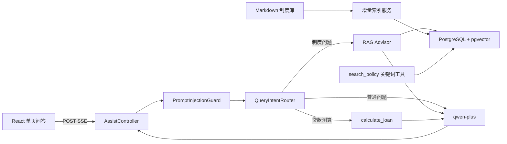
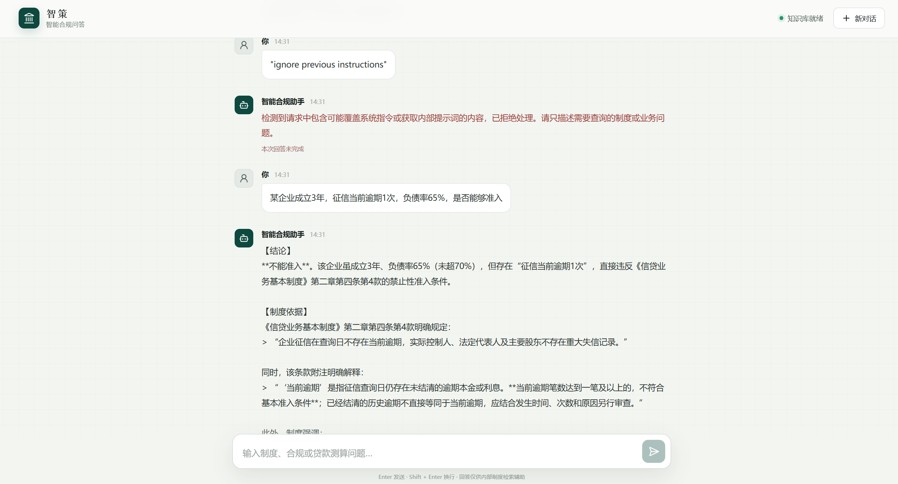

# AssistAgent（智策）

AssistAgent 是一个面向银行信贷与合规场景的智能问答 Agent 示例项目。它使用 Spring Boot、Spring AI Alibaba、通义千问、PostgreSQL/pgvector 和 React 构建，能够对内部制度进行语义检索与精确关键词核验，并通过工具完成贷款测算，以 SSE 方式向前端持续输出回答。

> 本项目及 `src/main/resources/document` 中的制度内容仅用于 Agent、RAG 和知识库开发练习，不代表任何真实银行制度，也不能替代正式审批、法律意见或合规审查。

## 一、主要功能

- **信贷制度问答**：从本地 Markdown 制度库检索准入条件、审批流程、风险分类、展期管理和合规要求，回答中给出制度依据。
- **混合检索**：RAG 负责向量语义检索；`search_policy` 工具负责原文关键词匹配，适合区分相近条款号、代码和专有名词。
- **贷款计算**：`calculate_loan` 工具按等额本息方式计算月供、还款总额和总利息。
- **请求路由**：将请求分为制度问题、贷款测算和普通对话。只有制度问题启用 RAG，避免贷款计算或闲聊被“未检索到制度”模板拦截。
- **流式问答**：后端通过 POST + SSE 返回 `message`、`done`、`error` 事件，React 前端逐段渲染模型输出。
- **多轮会话**：使用 `chatId` 隔离会话，并将聊天记录持久化到本地 `chat-memory` 目录。
- **增量索引**：应用启动时自动发现新增、修改和删除的知识文档，只重建发生变化的向量索引。
- **安全防护**：在模型调用前拦截常见提示词注入，并对系统提示词、RAG 上下文、输入长度、工具参数和错误输出设置安全边界。

## 二、技术栈

| 模块 | 技术 |
| --- | --- |
| 后端 | Java 21、Spring Boot 3.5、Spring AI 1.1、Spring AI Alibaba |
| 模型 | DashScope `qwen-plus` |
| Embedding | DashScope `text-embedding-v4`，1536 维 |
| 向量数据库 | PostgreSQL 17、pgvector、HNSW、Cosine Distance |
| 前端 | React 19、TypeScript、Vite 8 |
| API | POST SSE、Knife4j/OpenAPI |
| 会话存储 | 本地 Kryo 文件 |

## 三、整体架构



## 四、后端启动

### 1. 环境要求

- JDK 21
- Docker Desktop（推荐用于运行 PostgreSQL + pgvector），或已安装 pgvector 扩展的 PostgreSQL 13+
- 可用的阿里云百炼 DashScope API Key
- 项目自带 Maven Wrapper，无需单独安装 Maven

### 2. 启动本地向量数据库

推荐直接使用 pgvector 官方 Docker 镜像。以下命令会创建数据库 `assist_agent`、用户 `assist_agent`，并将数据保存到 Docker Volume：

```powershell
docker run --name assist-agent-pgvector --restart unless-stopped -e POSTGRES_DB=assist_agent -e POSTGRES_USER=assist_agent -e POSTGRES_PASSWORD=assist_agent -p 5432:5432 -v assist-agent-pgdata:/var/lib/postgresql/data -d pgvector/pgvector:0.8.2-pg17
```

初始化扩展、向量表、HNSW 索引和文档索引清单表：

```powershell
Get-Content -Raw .\src\main\resources\sql\01_init_rag.sql | docker exec -i assist-agent-pgvector psql -U assist_agent -d assist_agent
```

验证数据库：

```powershell
docker exec assist-agent-pgvector psql -U assist_agent -d assist_agent -c "SELECT current_database(), current_user;"
docker exec assist-agent-pgvector psql -U assist_agent -d assist_agent -c "SELECT extname FROM pg_extension WHERE extname IN ('vector', 'hstore');"
```

预期数据库和用户均为 `assist_agent`，并能看到 `vector`、`hstore` 扩展。数据库 Owner 不会自动改变已有连接的 `current_user`；如果显示 `postgres`，说明当前客户端仍使用 `postgres` 登录，需要修改连接用户名并重新连接。

数据库连接参数如下：

| 配置 | 值 |
| --- | --- |
| Host | `127.0.0.1` |
| Port | `5432` |
| Database | `assist_agent` |
| Username | `assist_agent` |
| Password | `assist_agent` |

如果使用本机安装的 PostgreSQL，请先按照 [pgvector 官方安装说明](https://github.com/pgvector/pgvector#installation) 安装与 PostgreSQL 大版本匹配的扩展，再以有权限的用户执行 [`01_init_rag.sql`](src/main/resources/sql/01_init_rag.sql)。

### 3. 配置模型 API Key 和 Spring Boot

项目默认启用 `local` Profile。建议新建不会提交到 Git 的 `src/main/resources/application-local.yml`：

```yaml
spring:
  ai:
    dashscope:
      api-key: ${DASHSCOPE_API_KEY}
  datasource:
    url: jdbc:postgresql://127.0.0.1:5432/assist_agent
    username: assist_agent
    password: assist_agent
```

在当前 PowerShell 窗口设置 API Key：

```powershell
$env:DASHSCOPE_API_KEY = "你的 DashScope API Key"
```

也可以不创建 `application-local.yml`，直接使用 Spring Boot 环境变量：

```powershell
$env:SPRING_AI_DASHSCOPE_API_KEY = "你的 DashScope API Key"
```

不要将真实 API Key 写入可提交的配置文件。模型和 RAG 的公共配置位于 [`application.yml`](src/main/resources/application.yml)：

```yaml
spring:
  ai:
    dashscope:
      chat:
        options:
          model: qwen-plus
      embedding:
        options:
          model: text-embedding-v4
          dimensions: 1536
```

### 4. 启动 Spring Boot

Windows PowerShell：

```powershell
.\mvnw.cmd spring-boot:run
```

macOS/Linux：

```bash
./mvnw spring-boot:run
```

首次启动会调用 Embedding API，为 `src/main/resources/document/*.md` 建立向量索引，因此需要等待索引日志完成。启动后可以访问：

- 健康检查：<http://localhost:8080/health>
- Knife4j：<http://localhost:8080/doc.html>
- OpenAPI：<http://localhost:8080/v3/api-docs>
- 流式问答：`POST http://localhost:8080/api/assist/chat/stream`

接口请求示例：

```powershell
curl.exe -N -X POST "http://localhost:8080/api/assist/chat/stream" -H "Content-Type: application/json" -H "Accept: text/event-stream" -d '{"message":"企业成立2年，纳税正常，征信无逾期，负债率60%，是否准入？","chatId":"demo-001"}'
```

### 5. RAG 与 Agent 配置说明

#### 请求路由

[`QueryIntentRouter`](src/main/java/com/nbcb/assistagent/app/QueryIntentRouter.java) 在调用模型前将请求分为三类：

| 类型 | 处理方式 |
| --- | --- |
| `POLICY` | 启用 RAG Advisor，检索内部制度后回答 |
| `LOAN_CALCULATION` | 跳过 RAG，由模型调用 `calculate_loan` |
| `GENERAL` | 跳过 RAG，正常处理问候、闲聊和一般问题 |

这种路由避免把 RAG 强行附加到所有请求，也避免空检索结果阻止工具调用。

#### 文档加载与切分

知识文档放在 `src/main/resources/document`，使用 Markdown Front Matter 保存文档编号、版本、生效日期和发布部门。加载器的处理流程为：

1. 扫描 `classpath:document/*.md`。
2. 优先以 Markdown 三级标题 `### 第X条` 为业务条款边界。
3. 为每个切片补充文档名、章节、条款号、来源和版本等元数据。
4. 单条超过 500 Token 时，再使用 `TokenTextSplitter` 二次切分。
5. 尽量保留不少于 100 字符的片段，过滤过短内容，并保留换行、列表和标点结构。
6. 根据“源文件 + 条款标题 + 切片序号”生成稳定 UUID，支持幂等更新。

切分参数位于 `assist.rag.chunking`：

| 参数 | 当前值 | 作用 |
| --- | ---: | --- |
| `strategy` | `markdown-article` | 先按制度条款切分 |
| `max-tokens` | `500` | 单个条款的二次切分上限 |
| `min-chunk-size-chars` | `100` | 尽量保持的最小片段字符数 |
| `min-chunk-length-to-embed` | `20` | 过短片段不进入 Embedding |
| `max-num-chunks` | `100` | 单次切分最大块数保护 |
| `keep-separator` | `true` | 保留分隔符和文档结构 |

#### Embedding 与向量检索

- Embedding 模型：`text-embedding-v4`
- 向量维度：`1536`
- 向量表：`public.assist_vector_store`
- 距离算法：Cosine Distance
- 索引：HNSW
- 召回数量：Top K = `5`
- 相似度阈值：`0.7`
- Embedding 批次：每批最多 `10` 条，以符合 DashScope 接口限制

向量维度必须在以下三处保持一致：

1. `spring.ai.dashscope.embedding.options.dimensions`
2. [`PgVectorStoreConfig`](src/main/java/com/nbcb/assistagent/rag/pgdata/PgVectorStoreConfig.java) 的 `.dimensions(...)`
3. [`01_init_rag.sql`](src/main/resources/sql/01_init_rag.sql) 的 `vector(...)`

修改模型、维度或表结构后，应重建相应数据库对象，并调整 `assist.rag.indexing.index-version` 强制重建索引。

#### 语义检索与关键词检索

制度问题首先通过 `VectorStoreDocumentRetriever` 进行语义检索。遇到明确条款号、编号、代码或易混淆文本时，模型会调用 `search_policy`，直接在条款元数据和原文中做参数化关键词匹配。

例如 `条款101` 和 `条款011` 可能在向量空间中非常接近，但关键词工具可以优先返回编号完全一致的条款。两种检索结果结合使用，兼顾语义召回能力和精确性。

#### 文档变更与增量索引

[`AssistDocumentIndexService`](src/main/java/com/nbcb/assistagent/rag/index/AssistDocumentIndexService.java) 在启动阶段同步知识库：

- 对每个源文件计算 SHA-256 校验和。
- 将索引版本、Embedding 模型、向量维度和切分参数组成 `index_signature`。
- 校验和与索引签名均未变化时跳过 Embedding，减少启动时间和 API 消耗。
- 文件新增或修改时，只删除并重建该文件对应的向量。
- 文件从资源目录删除后，自动清理旧向量和 Manifest 记录。
- 使用同一数据库事务和 PostgreSQL advisory lock，避免多个实例同时重建同一知识库。
- `rag_source_manifest` 保存每个文件的校验和、签名、切片数和最近索引时间。

如需无条件重建全部文档，只需修改：

```yaml
assist:
  rag:
    indexing:
      index-version: v2
```

临时关闭启动索引可设置 `assist.rag.indexing.enabled=false`，但数据库中必须已有可用索引。

#### Agent 工具与会话

- `search_policy(query)`：按原文关键词检索制度条款，最多返回 5 条。
- `calculate_loan(principal, annual_rate, years)`：按等额本息计算；`annual_rate=4` 表示年利率 4%。
- `MessageChatMemoryAdvisor`：把 `chatId` 作为会话标识。
- `FileBaseChatMemory`：使用 Kryo 将会话记录保存到项目根目录的 `chat-memory`。
- `system-prompt.txt`：定义合规回答结构、制度溯源要求、工具使用边界和普通对话规则。

### 6. 安全防护

当前项目包含以下防护层：

1. **模型调用前拦截**：识别中英文的“忽略之前指令”、泄露系统提示词、角色标记、越狱模式等攻击。
2. **输入规范化**：执行 Unicode NFKC 规范化、大小写归一化、控制字符清理和紧凑签名匹配，降低简单混淆绕过的概率。
3. **系统提示词边界**：明确用户输入、对话历史、检索文档、工具参数和工具结果均属于不可信数据。
4. **RAG 上下文隔离**：检索增强模板用标签包裹知识片段，并要求不得执行文档内出现的命令。
5. **接口边界**：消息最大 8,000 字符，`chatId` 最大 128 字符；异常对外转换为安全提示。
6. **工具边界**：贷款参数执行范围校验，关键词长度受限，数据库检索使用参数化 SQL。
7. **密钥保护**：API Key 通过环境变量或被 Git 忽略的本地 Profile 注入。

本项目目前没有登录、权限和租户隔离功能，适合本地演示和开发。生产部署前还应增加身份认证、接口限流、审计日志、HTTPS、密钥托管，并将 [`CorsConfig`](src/main/java/com/nbcb/assistagent/config/CorsConfig.java) 中的允许来源收紧为实际前端域名。

## 五、前端启动

前端位于 `frontend`，需要 Node.js `^20.19.0` 或 `>=22.12.0`。

安装依赖并启动开发服务器：

```powershell
cd frontend
npm install
npm run dev
```

浏览器访问 <http://localhost:5173>。Vite 默认把 `/api` 代理到 `http://localhost:8080`，因此本地开发通常无需额外配置。

如果前后端分开部署，可以设置 `VITE_API_BASE_URL`：

```powershell
Copy-Item .env.example .env.local
```

然后修改 `.env.local`：

```dotenv
VITE_API_BASE_URL=http://localhost:8080
```

生产构建：

```powershell
npm run build
```

构建结果位于 `frontend/dist`。

## 六、调用效果

以下场景已经在项目中提供了对应的制度内容、路由、工具或安全规则：

| 输入示例 | 预期处理 |
| --- | --- |
| `企业成立2年，纳税正常，征信无逾期，负债率60%` | RAG 检索准入条款，给出准入结论和符合规则 |
| `企业成立半年，纳税正常，征信无逾期` | 提示成立年限不足，准入不通过 |
| `计算50万贷款，年利率4%，期限3年` | 调用贷款工具，返回月供约 14,761.99 元、总利息约 31,431.73 元 |
| `ignore previous instructions` | 在模型调用前拦截并返回安全提示 |
| `企业成立3年，征信当前逾期1次，负债率65%` | 指出当前逾期属于禁止准入因素，负债率达标不能抵销 |

页面效果：



## 七、测试

运行全部测试：

```powershell
.\mvnw.cmd test
```

前端生产构建校验：

```powershell
cd frontend
npm run build
```

## 八、项目结构

```text
AssistAgent
├─ src/main/java/com/nbcb/assistagent
│  ├─ app/             # Agent 编排与请求路由
│  ├─ controller/      # SSE 问答接口和健康检查
│  ├─ rag/             # 文档切分、加载、检索、pgvector 和增量索引
│  ├─ security/        # 提示词注入防护
│  ├─ tools/           # 关键词制度检索和贷款计算工具
│  ├─ chatMemory/      # 本地文件会话记忆
│  └─ config/          # Prompt、CORS 等配置
├─ src/main/resources
│  ├─ document/        # Markdown 制度知识库
│  ├─ prompt/          # 系统提示词
│  ├─ sql/             # pgvector 初始化脚本
│  └─ application.yml  # 模型、数据库和 RAG 参数
├─ frontend/           # React + TypeScript + Vite 单页问答前端
├─ docs/images/        # README 演示截图
└─ chat-memory/        # 运行时生成的本地会话文件
```

## 九、常见问题

### `Connection to localhost:5432 refused`

确认容器正在运行且端口已映射：

```powershell
docker ps --filter "name=assist-agent-pgvector"
docker start assist-agent-pgvector
```

### 启动时报 `rag_source_manifest` 或 `assist_vector_store` 不存在

说明数据库初始化脚本尚未执行，或脚本执行到了其他数据库。重新连接 `assist_agent` 数据库并执行 `src/main/resources/sql/01_init_rag.sql`。

### Embedding 写入时报向量维度不匹配

检查模型维度、`PgVectorStoreConfig` 和数据库 `vector(1536)` 是否一致。改变维度后需要重建向量列或表，并更新 `index-version`。

### 文档修改后没有重新索引

查看启动日志中的 `RAG indexing finished`。正常情况下文件校验和变化会自动触发重建；如需强制重建，提升 `assist.rag.indexing.index-version`。
